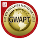
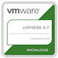

### Hi there 
Welcome to my GitHub. I'm Shawn, an Automation Engineer (fancier sounding DevOps, really...). I have primarily focused on the Systems side of the IT world for the last ~11 years in the US Army and across a few different companies. I have shifted more in the last couple years to focus more on security, automation, and virtualization. 

 

   

   
   

   
   
   
   
   
   
   
   
   
   
   
   
   
   
   
   
   
   
   
 

      
    
📣 Get in contact :

 
 
 
 
 
 

 
 
##  🔭 I’m currently Working on...
- <a href="https://github.com/tseclabs/gostigify">GoStigify</a>
- I am working on an Infrastructure as Code project (@TSecLabs) built with GO,Vue.js, oVirt, OpenShift, and GCP.
- I also am working to generate articles on a consistent bases for my <a href="https://tseclabs.com/blog" add target="_blank">blog</a>. 
## 🌱 I’m currently learning...
- Golang
- Vue.js
- OpenShift 4.5
- GCP

## Certifications
#### Current
- 
- 
- 

#### Working Toward 2020-2021
- GPYC
- RHCSA
- RHCE
- GCP Cloud Architect
- GCP Cloud Security Engineer
- GCP Cloud DevOps Engineer

## ⚡ Fun fact: ...
- I still play World Of Warcraft, although less frequent add my Battle Tag : AlphaGing
- [Let's Get Free Stocks with RobinHood!](https://join.robinhood.com/shawns428)

 
