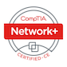

### Hi there 
Welcome to my GitHub. I'm Shawn, a Cyber Engineer with a love for learning. I like to consider myself somewhat of an IT mercenary, I've touched a bunch of different pieces of the greater IT field from sys-admin, small scale networking, NetApp administration, sprinkle in some cloud and DevOPS, and even a bit of security work.  The last couple years I have shifted to focus more on security, automation, and virtualization. 

 

   

  
   
   

   
   
   
   
   
   
   
   
   
   
   
   
   
   
   
   
   
   
   
 

      
    
📣 Get in contact :

 
 
 
 
 
 

 
 
##  🔭 I’m currently Working on...
- 
 
## 🌱 I’m currently learning...
- Golang
- ReactJS
- OpenShift

## Certifications
#### Current
- 
- 
- 

#### Working Toward 2022

## ⚡ Fun fact: ...
- I still play World Of Warcraft, although less frequent add my Battle Tag : AlphaGing

 
